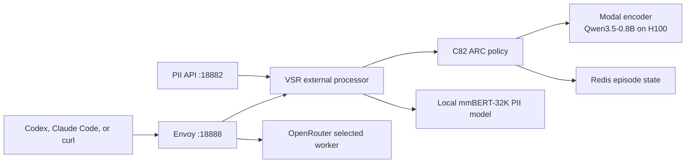

# C82 development environment

This is the copy-and-paste path for exercising Rayline's experimental C82
orchestrator in two ways:

1. the native Rayline router, with the C82 encoder running on Metal; and
2. vLLM Semantic Router (VSR), with the same immutable ARC policy and its
   Qwen3.5-0.8B encoder running on a scale-to-zero Modal H100.

Both paths use OpenRouter for the selected worker model. The VSR path supports
OpenAI Chat Completions, OpenAI Responses (Codex), Anthropic Messages (Claude
Code), and a separate local mmBERT-32K PII detector.

## What is running



The local services are Docker containers managed by `scripts/c82-dev`. The
Modal application is named `rayline-arc-encoder`; it scales to zero after five
idle minutes. The development endpoint is:

```text
https://atlasfutures-dev--rayline-arc-encoder-serve.modal.run
```

## Pinned source and artifacts

This setup fails early if either external checkout moves away from its pin:

| Component | Branch | Required commit |
| --- | --- | --- |
| Rayline Local | `codex/c82-local-orchestrator` | this checkout |
| Semantic Router | `codex/c82-vsr-live` (from `rayline/pl-0039`) | `f8ece7b2bdf1b978b03516074345923f16210521` |
| vLLM encoder | `rayline/pl-0039-causal-mean` | `162bcefe1b41c5bb35eccc2f2219ea39e2c74bb7` |
| C82 runtime artifact | `rayline-ai/mtrouter-c82` | `5a723bbdd5e65aeec991e73c2453100f03f5ebd5` |

The C82 artifact ID is
`c82-reliability-distillation-gate1-20260720`. Its immutable pricing snapshot
is the configuration at commit
`68574d8aa7cd8cff822747f124679e55481a32d7`; mutable live prices do not affect
the policy decision. This is a reproducibility pin, not a current price claim.

## One-time setup

The expected sibling layout is:

```text
~/Documents/
  rayline-c82-orchestrator/
  semantic-router/
  vllm/
```

The following credentials already live in `~/.bash_profile` on this
workstation:

- `HF_TOKEN`, with read access to the private C82 artifact;
- `OPENROUTER_API_KEY`; and
- `RAYLINE_ARC_MODAL_KEY` / `RAYLINE_ARC_MODAL_SECRET`, loaded from the
  dev-scoped endpoint-proxy token at
  `~/.config/rayline-c82/modal-proxy-token.json`.

The proxy-token file is mode `0600`; no credential is stored in Git. Check that
the two provider credentials exist without printing them:

```bash
source ~/.bash_profile
test -n "$HF_TOKEN" && test -n "$OPENROUTER_API_KEY" && echo "provider keys ready"
```

With OrbStack running, perform the one-time build:

```bash
cd ~/Documents/rayline-c82-orchestrator
scripts/c82-dev bootstrap

cd ~/Documents/semantic-router
make vllm-sr-dev

cd ~/Documents/rayline-c82-orchestrator
scripts/c82-dev vsr-auth
scripts/c82-dev vsr-start
```

`bootstrap` builds matching `rayline` and `rld` binaries, downloads and verifies
the private C82 bundle, and proves Metal/CUDA selection parity. `vsr-start`
downloads the public PII model on its first run, generates a private config,
and starts Redis, VSR, and Envoy. A cold Modal encoder can take a few minutes;
the script waits for artifact, encoder, and episode-store readiness.

The Modal encoder is already deployed. Redeploy it only after intentionally
changing its pinned implementation:

```bash
cd ~/Documents/rayline-c82-orchestrator
scripts/c82-dev vsr-deploy
```

## Try it

### Fast native C82 path

This is the shortest live check:

```bash
cd ~/Documents/rayline-c82-orchestrator
scripts/c82-dev doctor
scripts/c82-dev demo-claude
```

For an interactive Claude Code session in which C82 chooses every worker:

```bash
source ~/.bash_profile
cd ~/Documents/rayline-c82-orchestrator
target/release/rayline claude --orchestrator c82 --route all
```

Use `--route subagents` instead if the primary Claude session should remain on
its normal model and only subagents should be routed by C82.

### VSR + ARC smoke request

```bash
cd ~/Documents/rayline-c82-orchestrator
scripts/c82-dev vsr-start
scripts/c82-dev vsr-demo
```

The result includes `live: true`, the exact ARC-selected worker, the provider's
response model, and `C82_VSR_LIVE_OK`. Request model `auto`; ARC chooses among
the seven C82 worker IDs, including both reasoning-on and reasoning-off arms.

### Codex CLI through VSR + ARC

```bash
cd ~/Documents/rayline-c82-orchestrator
scripts/c82-dev vsr-codex
```

This uses Codex's required OpenAI Responses wire API and injects a unique ARC
episode ID. It leaves the user's normal Codex configuration untouched. Current
Codex may print a harmless model-metadata warning because VSR's `/v1/models`
payload uses the OpenAI `data` shape; the routed Responses request still
completes.

### Claude Code through VSR + ARC

```bash
cd ~/Documents/rayline-c82-orchestrator
scripts/c82-dev vsr-claude
```

The wrapper supplies the local Anthropic base URL, a unique episode header, and
a placeholder local API key only to that process. It does not change Claude
Code's saved settings.

### Select the PII model

The PII model is a detector, not one of C82's generative worker arms. Invoke it
through VSR's classification API:

```bash
cd ~/Documents/rayline-c82-orchestrator
scripts/c82-dev vsr-pii
```

The command uses synthetic contact data, does not reveal detected entity text,
and returns entity types, masked text, a security recommendation, and inference
time from `llm-semantic-router/mmbert32k-pii-detector-merged`.

### Any OpenAI-compatible terminal client

For OpenCode or another client, use the local OpenAI base URL
`http://127.0.0.1:18888/v1`, model `auto`, and include a stable
`x-rayline-episode-id` header for the duration of the session. OpenCode is not
installed in this environment, so Codex is the validated Responses-API client.

## Operate and recover

```bash
cd ~/Documents/rayline-c82-orchestrator

scripts/c82-dev status       # native router plus Docker services
scripts/c82-dev vsr-restart  # restart all local VSR services and run a live proof
scripts/c82-dev vsr-logs     # path/status logs only; prompts and keys are omitted
scripts/c82-dev vsr-stop     # local stack off; Modal remains scale-to-zero
scripts/c82-dev stop         # native and VSR paths off
```

If `vsr-start` reports that Docker is unavailable, start OrbStack. If it reports
a missing Semantic Router image, rebuild with `make vllm-sr-dev` from the
Semantic Router checkout. A Modal `401` means the endpoint proxy token is
missing or out of scope; rerun `scripts/c82-dev vsr-auth`.

## Validation commands executed

The final environment was checked with these exact commands:

```bash
cd ~/Documents/semantic-router/src/semantic-router
RAYLINE_ARC_TEST_RUNTIME_DIR="$HOME/.config/rayline-c82/artifact" \
  go test ./pkg/selection/raylinearc -count=1

cd ~/Documents/semantic-router
make agent-ci-gate CHANGED_FILES="src/semantic-router/pkg/extproc/processor_req_body.go src/semantic-router/pkg/extproc/processor_req_body_routing.go src/semantic-router/pkg/extproc/processor_req_body_routing_test.go src/semantic-router/pkg/extproc/rayline_arc_readiness.go src/semantic-router/pkg/extproc/rayline_arc_readiness_test.go src/semantic-router/pkg/selection/raylinearc/manifest.go src/semantic-router/pkg/selection/raylinearc/runtime_test.go src/semantic-router/pkg/selection/raylinearc/types.go"
make vllm-sr-dev

cd ~/Documents/rayline-c82-orchestrator
bash -n scripts/c82-dev
shellcheck scripts/c82-dev
scripts/c82-dev doctor
scripts/c82-dev start
scripts/c82-dev vsr-start
scripts/c82-dev vsr-demo
scripts/c82-dev vsr-codex
scripts/c82-dev vsr-claude
scripts/c82-dev vsr-pii
scripts/c82-dev vsr-restart
scripts/c82-dev status
```

The artifact test, repository gate, image build, shell checks, health/readiness
checks, and every live client/model demo passed. The final router process
reported zero error/fatal log events, and the private Modal proxy-token file
was verified as mode `0600`.

## Live validation receipt

All items below are **live**, not replay:

- 2026-07-30: native C82 doctor passed with Metal active, artifact hashes
  verified, and selection parity `1.0`.
- 2026-07-30: native C82 completed a Claude Code turn.
- 2026-07-30: VSR loaded the exact C82 artifact, verified the pinned Modal
  encoder build, acquired Redis episode state, selected an OpenRouter worker,
  and completed a Chat Completions request.
- 2026-07-30: the same VSR stack completed Codex Responses and Claude Code
  Messages requests.
- 2026-07-30: the local mmBERT-32K PII model detected synthetic PII and returned
  a blocking recommendation without revealing entity values.
- 2026-07-30: the VSR stack survived a full local restart and completed another
  live routed request.

These are development smoke results, not benchmark-quality, promotion, or cost
claims. Provider and Modal usage is live and should be inspected in their
dashboards when accounting for spend.
